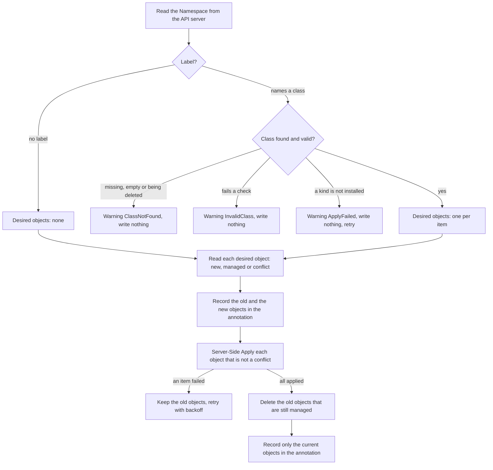

# NamespaceClass controller

A Kubernetes controller that adds a set of objects to every namespace of a "class". Cluster admins
define classes as `NamespaceClass` objects. A namespace uses a class through the label
`namespaceclass.akuity.io/name`. The controller creates the objects of the class in the namespace
and keeps them matching the class: when the namespace switches to another class, when the class
changes, and when someone edits or deletes one of the objects.

This is a solution to the Akuity take-home exercise "Namespace Class". It contains the CRD and the
controller, unit, envtest and end-to-end tests, sample classes, a [demo guide](docs/demo.md), and
[one page per use case](docs/use-cases/README.md) with example objects before and after each step.

```yaml
apiVersion: namespaceclass.akuity.io/v1alpha1
kind: NamespaceClass
metadata:
  name: public-network
spec:
  resources:                     # complete manifests of namespaced objects, any kind
    - apiVersion: networking.k8s.io/v1
      kind: NetworkPolicy
      metadata:
        name: ingress
      spec:
        podSelector: {}
        policyTypes: [Ingress]
        ingress:
          - from:
              - ipBlock: {cidr: 0.0.0.0/0}
---
apiVersion: v1
kind: Namespace
metadata:
  name: web-portal
  labels:
    namespaceclass.akuity.io/name: public-network
```

```console
$ kubectl get networkpolicy -n web-portal
NAME      POD-SELECTOR   AGE
ingress   <none>         0s
```

## Contents

- [Quick start](#quick-start)
- [API](#api)
- [Behavior](#behavior)
- [How it works](#how-it-works)
- [Design decisions](#design-decisions)
- [Failure handling and events](#failure-handling-and-events)
- [Testing](#testing)
- [Operations notes](#operations-notes)
- [Not covered and future work](#not-covered-and-future-work)
- [Notes on the requirement](#notes-on-the-requirement)
- [Project layout](#project-layout)

## Quick start

You need Go, Docker and kubectl 1.26 or newer (the guides use `kubectl events`). The Makefile
installs kind, kustomize, controller-gen, setup-envtest and golangci-lint into `bin/` at fixed
versions.

```sh
make test         # unit tests and envtest specs
make lint
make test-e2e     # creates the kind cluster namespaceclass-test-e2e, runs the e2e specs, deletes the cluster

# Run the controller in a local kind cluster.
make kind-deploy KIND_CLUSTER=namespaceclass-demo
export KUBECONFIG=$PWD/bin/kind-namespaceclass-demo.kubeconfig
kubectl apply -f config/samples/namespaceclass_v1alpha1_public-network.yaml
kubectl apply -f config/samples/namespace_web-portal.yaml
kubectl get networkpolicy -n web-portal

# Delete the cluster.
make cleanup-test-e2e KIND_CLUSTER=namespaceclass-demo
unset KUBECONFIG
```

The [demo guide](docs/demo.md) shows every main behavior in about 15 minutes, with the expected
output of each command. `hack/demo.sh` runs it step by step.

The [manual testing guide](docs/manual-testing.md) shows how to try the controller by hand, one
kubectl command at a time, with the controller in the cluster or on your machine (`make run`).

The kind targets use their own kubeconfig file, `bin/kind-<cluster>.kubeconfig`, so they do not
touch your current kubectl context.

## API

`NamespaceClass` is cluster-scoped, in the API group and version `namespaceclass.akuity.io/v1alpha1`,
with the short name `nsclass`. Its spec has one field, `resources`: a list of complete manifests.
It has no status.

### What an item may contain

- Any namespaced kind that the cluster serves, including custom resources. The CRD of a custom
  resource may be installed after the class.
- `apiVersion`, `kind` and `metadata.name` are required.
- From `metadata`, the controller uses only `name`, `labels` and `annotations`.
  `metadata.namespace` must be empty, because the object is created in every namespace that uses
  the class. `metadata.generateName` is not supported. Other metadata fields and `status` are
  ignored.
- Every other top-level field (`spec`, `data`, `rules`, `roleRef`, ...) is copied to the created
  object as written. There is no templating.

### Checks and limits

A class has at most 100 items, and its name has at most 63 characters.

| Check | Done by | When the check fails |
|---|---|---|
| `apiVersion` and `kind` are set, `apiVersion` has at most one `/` (so `a/b/c` is rejected), and `metadata` is valid object metadata | API server, when the class is saved | The class is rejected. |
| `metadata.name` is set and `metadata.generateName` is not | API server (CEL rules on each item) | The class is rejected. |
| At most 100 items | API server | The class is rejected. |
| The class name has at most 63 characters, because it is used as a label value | API server (CEL rule) | The class is rejected. |
| `apiVersion` has a version after the `/` (so `example.com/` is rejected) | Controller | Warning `InvalidClass`; nothing changes. |
| `metadata.namespace` is empty | Controller | Warning `InvalidClass`; nothing changes. |
| No two items have the same group, kind and name (the version is ignored) | Controller | Warning `InvalidClass`; nothing changes. |
| The kind is namespaced | Controller | Warning `InvalidClass`; nothing changes. |
| The item is not the ServiceAccount `default` or the ConfigMap `kube-root-ca.crt`, which Kubernetes creates and changes in every namespace | Controller | Warning `InvalidClass`; nothing changes. |
| The kind exists in the cluster | Controller | Warning `ApplyFailed`; nothing changes; retried until the CRD is installed. |
| The fields are valid for the kind (for example a NetworkPolicy spec) | API server, when the controller applies the object | Warning `ApplyFailed` for that item; retried. |

### Labels, annotations and owner references

| Key | Set on | Set by | Meaning |
|---|---|---|---|
| label `namespaceclass.akuity.io/name` | Namespace | you | The class the namespace uses. Remove the label to opt out. |
| label `namespaceclass.akuity.io/class` | each created object | controller | Marks the object as created by the controller and names its class. A value set in the item is replaced. Do not add this label to other objects: the controller treats any object with it as its own. |
| annotation `namespaceclass.akuity.io/managed-resources` | Namespace | controller | JSON list of `{group, kind, name}` of the objects the controller created in the namespace. Do not edit it. |
| owner reference to the NamespaceClass (`controller: true`) | each created object | controller | Lets the Kubernetes garbage collector delete the object with its class. |

The controller treats an object as its own ("managed") when it has the class label **or** an owner
reference to a NamespaceClass. It only changes or deletes managed objects. To stop the controller
from managing an object, remove both the label and the owner reference.

### Field manager

The controller applies objects with Server-Side Apply, with the field manager
`namespaceclass-controller`. This name must never change. Server-Side Apply removes a field from a
live object only when the same field manager applied it before. With a new name, fields that a
class stops setting would stay on the objects. The same name is the reporter of the controller's
events.

## Behavior

[`docs/use-cases/`](docs/use-cases/README.md) has one page for each row: example objects before and
after, each step of the run, and the events.

| Situation | What the controller does |
|---|---|
| A namespace is created with the label, or the label is added later | Creates the objects of the class in the namespace. |
| The label changes from class A to class B | Applies the objects of B, then deletes the objects that only A had. An object that both classes define (same group, kind and name) is updated in place: it keeps its UID, its class label and owner reference move to B, fields that only A set are removed, and fields that others set stay. |
| The label is removed | Deletes every object it created in the namespace and removes the annotation. |
| A class is edited | In every namespace of the class: creates added items, updates changed items and deletes removed items. A field removed from an item is also removed from the live objects. |
| A class is deleted | The Kubernetes garbage collector deletes the objects (owner references). `kubectl delete --cascade=orphan` keeps them. The controller deletes nothing itself. Namespaces that are still labeled with the class get a `ClassNotFound` warning. |
| The label names a class that does not exist, names a class that is being deleted, or is empty | Changes nothing; Warning `ClassNotFound`. Only a missing label means "opt out", so a typo never deletes anything. When the class is created, the namespace is processed again. |
| An object with the same kind and name exists, and the controller did not create it | Leaves it unchanged; Warning `Conflict`. The other objects of the class are applied, and the objects of the old class are deleted, as usual. A conflict is not an error and is not retried: the name is checked again the next time the namespace is processed for another reason. |
| Someone edits or deletes a created object | Puts it back, usually within a second (drift correction). Fields that the class does not set are left alone. |
| Someone removes only the class label from a created object | Puts the label back, because the owner reference still marks the object as managed. When both the label and the owner reference are removed, the object is no longer managed and is treated like any existing object (`Conflict`). |
| The class fails a controller check | Changes nothing; Warning `InvalidClass` on the namespace and on the class. |
| A kind in the class is not installed yet | Changes nothing; Warning `ApplyFailed`; retries with backoff (at most 5 minutes apart) and applies the class once the CRD exists. |
| The API server rejects one item (forbidden, changed immutable field, unknown field) | Applies the other items, deletes nothing, Warning `ApplyFailed`, retries with backoff. |
| The annotation was edited and cannot be read | Warning `InvalidAnnotation`. The list is treated as empty, so nothing is deleted based on it. The next run that gets past the class checks writes the annotation again. A run that stops with `ClassNotFound`, `InvalidClass` or a kind that is not installed writes nothing, so the annotation stays as it is until then. |
| Changes were made while the controller was stopped | Handled at startup: every namespace with the label or the annotation is processed. |
| The namespace is being deleted | Nothing. Kubernetes deletes the objects with the namespace. |

## How it works

The controller is one controller-runtime reconciler. Each run handles one namespace: it compares
what the namespace should have (from the label and the class) with what the controller created
there before (from the annotation), and fixes the difference.

### One run



1. Read the Namespace from the API server, not from the cache, so that the annotation written by
   the previous run is never missed. Stop if the namespace is gone or being deleted.
2. Read the previous list from the annotation.
3. Work out the desired objects. Without the label, there are none: this is how opting out deletes
   everything. With the label, build one object per item of the class and check the class as a
   whole. A missing class, an invalid class or a kind that is not installed stops the run before
   anything is written.
4. Make sure that a drift watch exists for each kind of the desired objects (see
   [What starts a run](#what-starts-a-run)).
5. Read the metadata of each desired object from the API server. The object does not exist yet
   (new), it is managed (it will be updated), or it exists and is not managed (a conflict: Warning
   `Conflict`, and the object is left out of the run).
6. Write `previous ∪ (desired − conflicts)` to the annotation, unless it already holds that list.
   An object is always listed before it is created. The write carries the Namespace's
   resourceVersion, so it fails if the Namespace changed in the meantime, and the run is retried.
7. Apply each desired object that is not a conflict with Server-Side Apply (force, field manager
   `namespaceclass-controller`). Record `Created` or `Updated` (nothing when the object did not
   change). When an item fails, record `ApplyFailed` and continue with the others.
8. Only if every item was applied: delete each object of `previous − desired` that is still
   managed, with a UID and resourceVersion precondition and background propagation (so that, for
   example, the Pods of a Job go too). An object or kind that is already gone counts as deleted.
   An object that is no longer managed is left alone.
9. Write `(desired − conflicts) ∪ (objects whose deletion failed)` to the annotation, or remove the
   annotation when the list is empty. When step 8 was skipped, the annotation keeps the list of
   step 6, so a later run still deletes the old objects.
10. Return an error when a read, an apply or a delete failed: the namespace is retried with
    exponential backoff, from 5 milliseconds up to 5 minutes. When the drift watch of a kind used in
    this run has not finished its first list yet, run again after 1 second.

### What starts a run

| Source | Events that start a run, and for which namespace |
|---|---|
| Namespaces | A namespace with the label or the annotation is created (at startup, every namespace arrives as created). The label is added, removed or changed. The periodic resync, about every 10 hours. The controller's own annotation writes do not start a run. |
| NamespaceClasses | A class is created or deleted, its spec changes, or its deletion starts while a finalizer holds it (the last two set a new generation). Every namespace whose label names the class. |
| Created objects (drift watches) | A created object is updated (new resourceVersion) or deleted. The namespace of the object. |

The drift watches work like this:

- There is one metadata-only watch per kind (group and kind). It is added the first time a class
  uses the kind, and it is never removed.
- The watches use a separate cache that only holds objects with the label
  `namespaceclass.akuity.io/class`, without managedFields. Nothing reads from this cache.
- A new watch first lists the existing objects in the background, and until then it reports no
  changes. The controller tracks this per kind, from the watch's own informer. While the watch of a
  kind used by a run has not finished its first list, the run asks to run again after 1 second
  (only when the run had no error), so edits and deletions in that short window are caught.
- A watch that never finishes its list (for example for a create-only kind such as
  LocalSubjectAccessReview, a CRD that was deleted before the first list, or an aggregated API
  that is down) counts as ready after a grace period of 30 seconds. So these extra runs stop.

## Design decisions

### A label on the namespace, not an annotation

The requirement's text says "annotated", but its example uses a label. We use the label
`namespaceclass.akuity.io/name`, because labels can be selected. The controller finds the
namespaces of a class with a label selector on its cache, and users can run
`kubectl get namespace -l namespaceclass.akuity.io/name=public-network`. Annotations cannot be
selected.

### Server-Side Apply

Each object is applied with Server-Side Apply, with force and a fixed field manager. The API server
then removes fields that the class no longer sets, keeps fields that others set (defaults, other
controllers, users), and handles every kind, including custom resources, without Go types. Force
means the class decides the fields it sets: if another field manager changes such a field, the
controller changes it back.

Alternatives we rejected: create and update with full objects (this overwrites fields of other
writers, and both sides keep changing the object back), and client-side three-way merge (it needs a
last-applied annotation on every object, and Go types for strategic merge).

### A list of created objects, written before create, with deletes only after a full apply

The annotation `namespaceclass.akuity.io/managed-resources` lists every object the controller
applied in the namespace. The controller uses it to find what to delete after a switch, a class
edit or an opt-out. Without it, the controller would have to list every resource type of the
cluster in the namespace (a class can hold any kind), or remember the old class, which may already
be changed or deleted.

- The list is written **before** the objects are created. If the controller stops right after
  creating an object, the object is already in the list, so a later run can still delete it. At
  worst the list names an object that does not exist, which is harmless: deleting a missing object
  counts as done.
- Old objects are deleted **only after every item was applied**. A rejected item never leaves the
  namespace with fewer objects than before. For example, a switch to a class with a broken item
  does not remove the restrictive NetworkPolicies of the old class.
- Conflicts are never added to the list, so the controller never deletes an object it did not
  create.

Alternatives we rejected: listing objects by label across every kind (needs discovery and list
permission for every kind, and is slow), and a separate inventory object per namespace (one more
object to keep up to date, with the same ordering problems). The annotation is small: one short
entry per object.

### Existing objects are left alone

When an object with the same kind and name already exists and the controller did not create it,
the controller does not take it over. It records a `Conflict` warning and applies the rest of the
class. Taking over could silently replace a user's configuration, or delete it later when the
namespace opts out. The conflict is not retried, because only a person can fix it (delete or
rename the object, or change the class). Retrying would only repeat the warning. The name is
checked again the next time the namespace is processed for any other reason.

### Owner references and garbage collection, not a finalizer

Every created object has an owner reference to its class (`controller: true`). Kubernetes allows a
cluster-scoped owner for namespaced objects. When a class is deleted, the garbage collector deletes
the objects, also when the controller is not running. `kubectl delete --cascade=orphan` keeps them.

The alternative was a finalizer on the class: the controller deletes the objects in every namespace
before the class goes away. We rejected it because a class could then not be deleted while the
controller is down or uninstalled (it would stay in Terminating), and the controller would have to
find the objects of a class in every namespace. The downside of owner references: deleting the CRD
deletes every class, and then every created object (see [Operations notes](#operations-notes)).

### Metadata watches in a separate cache, and live reads

Drift correction needs to know when a created object changes. The controller watches only the
metadata of objects with its label, in a separate cache, without managedFields. Memory stays small:
no full objects, and no objects that the controller did not create. No other read is affected.

The reads that decide what to do (the Namespace, each desired object before the apply, each object
before a delete) go to the API server, not to a cache. A cache can lag behind, for example behind an
annotation written a moment ago, and a run must not act on old data.

Alternatives we rejected: watching full objects of every kind (for example every Secret in the
cluster would be held in memory), and relying on the periodic resync only (drift would be fixed
hours later).

### Events instead of a status

Results are reported as events about the namespace (and about the class for `InvalidClass`). A
status on the class would need results from many namespaces, and the Namespace has no place for a
status of ours. Events are enough for this exercise. A status on the class is future work.

### No templating

Items are applied as written. Values such as the namespace name cannot be inserted. Most
references between namespaced objects already mean "in the same namespace" when the namespace is
left out. For example, a RoleBinding subject of kind ServiceAccount without a namespace means the
ServiceAccount in the RoleBinding's own namespace (see the
[team-baseline sample](config/samples/namespaceclass_v1alpha1_team-baseline.yaml)). Templating
would need a template language, escaping rules and more checks.

### Namespaced kinds only

A class creates objects inside each namespace that uses it. A cluster-scoped object (for example a
ClusterRole) would be shared by all these namespaces, so it is not clear which namespace it belongs
to or when it may be deleted. The controller rejects such a class (`InvalidClass`).

## Failure handling and events

| Reason | Type | When | Retried |
|---|---|---|---|
| `Created` | Normal | An object was created. | |
| `Updated` | Normal | Applying an object changed it. | |
| `Deleted` | Normal | An object that is no longer wanted was deleted. | |
| `ClassNotFound` | Warning | The label names a class that does not exist or is being deleted, or the label is empty. Nothing changed. | No. Creating the class starts a new run. |
| `InvalidClass` | Warning | The class failed a controller check. The note lists every problem. Recorded about the namespace and about the class. Nothing changed. | No. Editing the class starts a new run. |
| `Conflict` | Warning | An object with the same kind and name exists, and the controller did not create it. The object is left unchanged. | No. Checked again the next time the namespace is processed. |
| `ApplyFailed` | Warning | A kind is not installed, or the API server rejected an object. | Yes, with backoff. |
| `DeleteFailed` | Warning | An object could not be deleted. It stays in the annotation. | Yes, with backoff. |
| `InvalidAnnotation` | Warning | The annotation cannot be read. It is treated as empty, so nothing is deleted based on it. The next run that gets past the class checks writes it again. | Not needed. |

Failed runs are retried per namespace with exponential backoff, from 5 milliseconds up to 5
minutes. A conflict is not an error.

The events are written with the `events.k8s.io` API. Events about Namespaces and NamespaceClasses
are stored in the `default` namespace, because both are cluster-scoped. List them with:

```sh
kubectl events -n default --for namespace/web-portal
kubectl events -n default --for namespaceclass/internal-network
```

An event about one object names it both in its note (for example
`created NetworkPolicy.networking.k8s.io/ingress`) and as its related object.

## Testing

| Layer | Where | What it covers |
|---|---|---|
| Unit tests (`testing`, table-driven) | `internal/inventory`, `internal/resources`, `internal/controller` | The annotation format; the "managed" check; building the objects of a class and every class check; the event filters; event notes; the readiness of drift watches. |
| envtest with Ginkgo | `internal/controller` | A real API server and etcd (Kubernetes 1.37) with the real manager running the reconciler. Every row of the behavior table, drift correction, no writes once the namespace matches its class, a restart of the controller, and test-only CRDs (Widget, Gizmo), including one installed while the controller runs. |
| envtest | `api/v1alpha1` | The CRD schema and CEL rules (accepted and rejected classes). Every manifest in `config/samples` and `docs/demo` is accepted, and every object built from a sample class passes a dry-run apply. |
| End-to-end on kind, with Ginkgo | `test/e2e` | The real image, deployed with `make deploy`: the samples, switch, class edit, drift, conflict, any kind, class deletion with the real garbage collector (with and without `--cascade=orphan`), opt-out. One more spec (label `demo`) runs `hack/demo.sh`. |

How to run them:

| Command | What it does |
|---|---|
| `make test` | Unit tests and envtest specs. Downloads the envtest binaries into `bin/`. |
| `make lint` | golangci-lint. |
| `make test-e2e` | Creates the kind cluster `namespaceclass-test-e2e`, builds and loads the image, deploys the controller, runs the e2e specs, and deletes the cluster. When a spec fails, the cluster is kept. |
| `make demo-check KIND_CLUSTER=namespaceclass-demo` | Runs `hack/demo.sh` without pauses against a cluster set up with `make kind-deploy`. |

envtest runs only kube-apiserver and etcd, without kube-controller-manager. So it lacks:

- **The garbage collector.** Owner references delete nothing. Class deletion with garbage
  collection is tested on kind. In envtest, a spec checks that the controller itself deletes
  nothing when a class is deleted.
- **The namespace controller.** A deleted namespace stays in Terminating forever. The specs use a
  new namespace name each time, and use this to test "the namespace is being deleted".
- **The ServiceAccount controller and the root CA publisher.** The ServiceAccount `default` and
  the ConfigMap `kube-root-ca.crt` do not exist. The check that rejects them in a class is tested
  with unit tests and an envtest spec.

There is no network plugin in envtest, so a NetworkPolicy is only an object. The kind tests also
only check that the objects exist, not that traffic is blocked.

## Operations notes

- **Deleting the CRD deletes every created object.** Deleting the CRD (`make uninstall`, or
  `make undeploy`, which deletes the CRD too) deletes every NamespaceClass. The garbage collector
  then deletes every created object, including restrictive NetworkPolicies. To keep the objects,
  first delete the classes with `--cascade=orphan` in the same cluster, for example in the demo
  cluster:
  `KUBECONFIG=$PWD/bin/kind-namespaceclass-demo.kubeconfig kubectl delete namespaceclass --all --cascade=orphan`.
  The kept objects still have the label `namespaceclass.akuity.io/class`. If the controller runs
  again later and a namespace's label is removed, it deletes them; remove that label from objects
  you want to keep for good.
- **Deployment.** The controller runs as one replica with leader election, as generated by
  kubebuilder, with a ClusterRole that allows every verb on every resource.

## Not covered and future work

### Known limitations

- Create-only kinds (for example LocalSubjectAccessReview or Binding) pass the class checks and
  then fail with `ApplyFailed` on every run, retried with backoff up to 5 minutes apart.
- The watch of a kind that cannot be listed (a create-only kind, a deleted CRD, an aggregated API
  that is down) keeps retrying in the background and logging errors, because watches are never
  removed.
- There is a small race between the read of an object and the forced apply. If a user creates an
  object with the same name in that moment (or removes the controller's label and owner reference
  from one), the apply takes the object over.
- A drift watch starts a full run for every update of a created object, also when only its status
  changed. For example, the status of a ResourceQuota (such as `compute` in the team-baseline
  sample) changes whenever a pod in its namespace is created or deleted, and each change starts a
  run: one live read and one apply that changes nothing, for each object of the class.
- The first class deletion after the CRD is installed can take up to about 30 seconds, because the
  garbage collector must first discover the new CRD.
- A conflict is only checked again when the namespace is processed for another reason: a class
  edit, a label change, drift of another object, a restart of the controller, or the resync about
  every 10 hours.

### Future work

- **Security hardening.** The controller's ClusterRole allows every verb on every resource, so any
  kind works without RBAC setup. Next steps: narrow it to the kinds that classes may use; decide
  who may write classes (anyone who can write a class can create objects, such as RoleBindings, in
  every namespace that uses it) and who may label namespaces (anyone who can label a namespace can
  pick any class for it); keep Secrets out of classes (anyone who can read a class can read its
  content).
- **A status on NamespaceClass** (observed generation, namespaces up to date, namespaces failing),
  written by a second controller keyed by class.
- **Adoption of existing objects**, as an explicit opt-in, instead of a `Conflict`.
- **Labels and annotations on the Namespace itself**, such as Pod Security Admission's
  `pod-security.kubernetes.io/enforce`. Today a class can only create objects inside the namespace.
- **Templating**, for example the namespace name in a value.
- **Cluster-scoped objects.**
- **Several classes per namespace.**
- **Replacing an object when an immutable field changes** (for example the `roleRef` of a
  RoleBinding). Today this fails with `ApplyFailed` until the class or the object is fixed.
- **Removing watches** for kinds that no class uses anymore.
- **A warning or a guard before the CRD is uninstalled** (see [Operations notes](#operations-notes)).

## Notes on the requirement

- The examples use `apiVersion: v1` for NamespaceClass. This can only be a placeholder: a CRD
  cannot be in the core API group. The API here is `namespaceclass.akuity.io/v1alpha1`.

## Project layout

| Path | Contents |
|---|---|
| `api/v1alpha1/` | The NamespaceClass type with its CRD markers, and the label and annotation names. |
| `internal/inventory/` | The list in the annotation (parse and encode) and the "managed" check. |
| `internal/resources/` | Builds the objects of a class for one namespace, and checks the class. |
| `internal/controller/` | The reconciler: the order of a run, apply, delete, the annotation, watches and events. |
| `cmd/main.go` | Manager setup. |
| `config/` | Kustomize manifests (CRD, RBAC, deployment) and the samples in `config/samples/`. |
| `docs/demo.md`, `docs/demo/` | The demo guide and the changed class it uses. |
| `docs/manual-testing.md` | How to test the controller by hand on a kind cluster, one kubectl command at a time. |
| `docs/use-cases/` | One page per use case, with example objects before and after each step. |
| `hack/demo.sh` | Runs the demo guide step by step. |
| `test/e2e/` | End-to-end specs on kind. |
